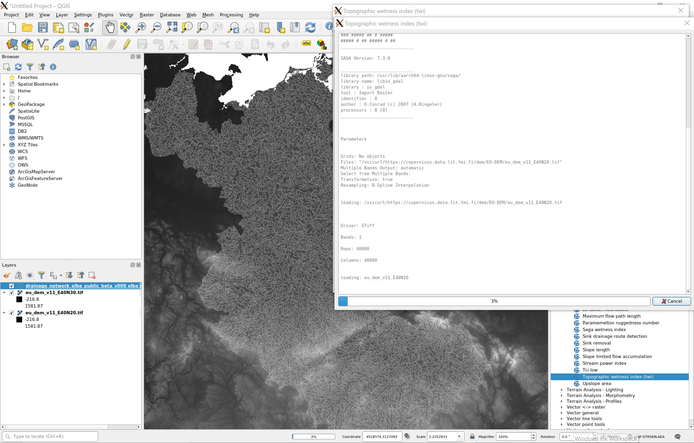
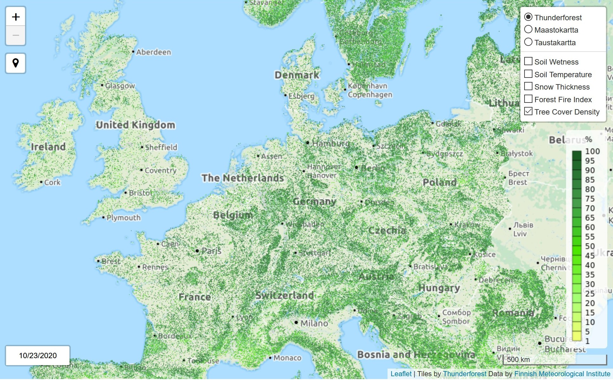
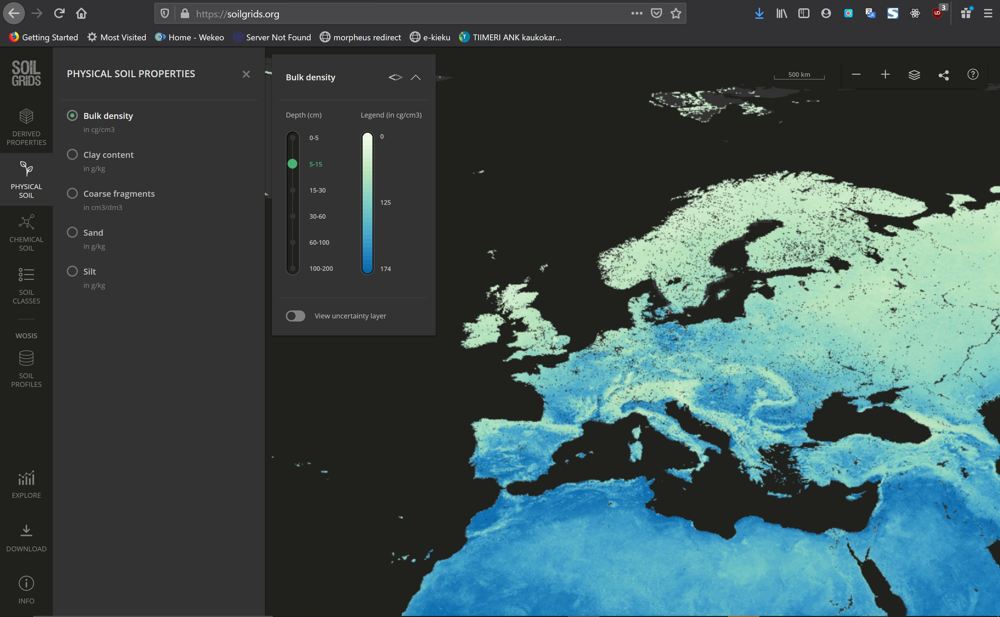
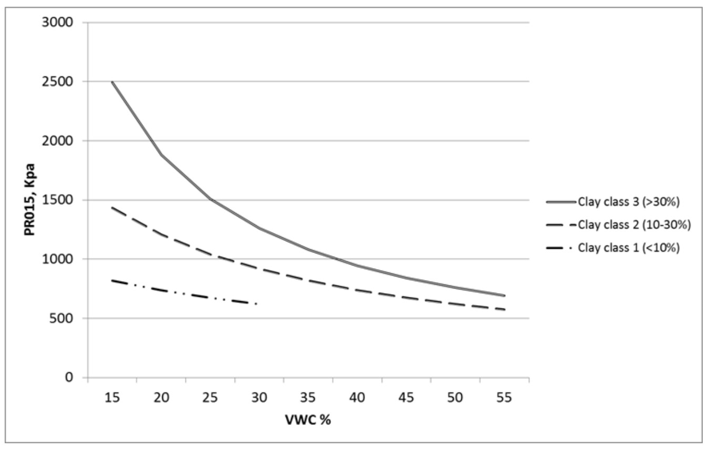

# Trafficability
The main point of harvesterseasons.com service is to analyze and predict trafficability conditions. Trafficability is over Finland currently a combination of 16m resolution static trafficability analysis and the impact of weather and seasonal forecasts of soil properties to improve or worsen the static analysis.The static analysis is only available in Finland currently. To expand our service to European and eventually global availability, this report outlines a plan how to expand the static analysis in Europe and worldwide.

## Trafficability methods used in Finland
The methods used were developed in the EFFORTE H2020 project (grant agreement No 720712) coordinated by Natural resources institute Finland. The next chapter is summarizing the main outcomes of EFFORTE based generally on the projects deliverables from WP1 (D1.1, D1.2 and D1.3) and in particular for the static trafficability map on data described in D3.3. The validation performed in EFFORTE is described in D4.5.

### Static trafficability map
ALS Airborne Laser Scanning and the derived digital elevation model is the key data used. Trafficability is analyzed into 6 classes, open water and no data (missing ALS):
1. Operations possible in all seasons
2. Operations possible in summer, mineral soils
3. Operations possible in summer during dry season, mineral soils
4. Operations possible in summer, peatlands
5. Operations possible in summer during dry season, peatlands
6. Operations possible only during frost or thick layer of snow
7. Open water
8. No data (missing airborne laser scanning (ALS) data) 

All data sets needed are described in the following table: 

| Explanatory variable | Data source |
| --- | --- |
| Differantiate Peatland/mineral soil | Peatland mask from National Land Survey’s topographic database |
| Average ditch depth/ground water height | ALS data and National Land Survey’s topographic database |
| Topographic Wetness Index TWI | Digital terrain model (DTM) | 
| Estimate amount of vegetation based on its height distribution | Processed ALS data |

ALS is done in Finland for almost 90% of the country territory at 2 m resolution, but the end product is resampled at 16 m, because this fits the national grid for most other forest data.

The flow chart for defining the 6 trafficability classes is a clear description of the definitions process.

Mineral soil | Peatland
Base classes calculated from TWI mineral soil thresholds | Base classes calculated from TWI peatland thresholds
Adjust base levels +/- a level depending on vegetation amount | Adjust +/- a level depending on vegetation amount
 | Adjust +/- a level depending on ditch depth

The two strands for mineral soil and peatland are combined. It is good to notice that in general both land types have each four classes from any season to winter and a normal summer and a dry summer between. Vegetation amount reflects the amount of roots in the ground, where roots clearly improve trafficability.

An important fact to consider for static trafficability maps is the definition of the TWI thresholds for mineral soils and peatlands. The currently used thresholds were determined via numerous field tests in several parts of Finland. The thresholds are the intellectual property rights of Arbonaut Oy, a finnish SME specialized in forest related GEO intelligence.

## Opportunities for static trafficability maps in Europe
High resolution Digital Elevation Maps or Digital Terrain Models are not available as a combined data set for Europe. The best DEM currently available is a 30 m DTM from TandemX radar measurements from ESA Copernicus data services or the 25m EU-DEM distributed by the Copernicus Land monitoring services.  
Both data sets have been downloaded and will be evaluated for making a Topographic Wetness Index. SAGA GIS software is offering a straightforward tool for calculating it or within QGIS another method allows calculation with the addition of a drainage network data set.

For a higher resolution DEM also large parts of Europe have been scanned by airborne laser. A collection of available data sets it available at [Slovenian archeology blogspot](https://arheologijaslovenija.blogspot.com/p/blog-page_81.html). France has only one of its regions covered and Germany 6 of 16, so this list is not enough to cover even Western Europe, but in some countries this allows a proper trafficability map to be produced.

A compromize could be to accept the 25/30m resolution DEM based products as the target resolution for the maps as for this resolution the Copernicus land services offer also the peatland/marshland distinction from the [2018 Corine Land Cover](https://land.copernicus.eu/pan-european/corine-land-cover) and the drainage network useful in the TWI ptoduction.

There is also a Pan-European high resolution (10m for 2018 and 20m for 2015) water and wetness product available, which distinguishes water bodies, temporary water, permanent wetness and temporary wetness. Permanent wetness should be correlating with winter season trafficability and the temporary wetness class with the dry summer season at least for peatlands. Unfortunately the 2018 product is not yet finished and product currently released is not yet including the temporary wet class. The overlap of the trafficability winter class and permanent wetness was XX % using QGIS tools for spatial overlap.

Vegetation data to indicate root amounts could be based on the high resolution [Copernicus Pan-European tree cover density](https://land.copernicus.eu/pan-european/high-resolution-layers/forests) maybe combined with the dominant leaf type product in the same service. 

The only data that has no clear path to production is ditch depth, which is used for Finnish peatlands to find more dry summer opportunities. This deficit is hardly as relevant outside of Finland as peatlands are less frequent and they are not as often dried with ditches. 

## Opportunities for static trafficability maps globally
The 30m DEM available in Copernicus is available globally. TWI can be produced worldwide, but land cover information is available at resolutions lower than the TWI. Copernicus Global Land service has a 100m resolution product updated 2019. The herbaceus wetland class could be used as a peatland proxy, but considering both resolution and less detail in classification it might be insufficient. The future is looking better as European products have been defined in CLC+ to be 10m rasters and there are indications that production will become global and more automatic at the same time. With twin satellite Sentinel-2 operations this seems to be very achievable.

Globeland30.org is a chinese data set at 30m resolution based on Landsat and chinese satellites. Based on the web page the data is not fine grained enough for distinguishing peatlands.

Global trafficability is at the moment requiring many steps that have not been made available already, so global service should be evaluated in a years time again.

## Improving in general on trafficability issues on natural ground
The classification for trafficability in forest areas is very much based on Finnish forestry operations, which are relying on winter conditions for a large part with summer actions gaining ground. In other European forests winter conditions are seldom, so the attention is mainly to good conditions in general. In this respect soil characteristics in addition to soil wetness could be addressed much more than the basic assumption of mostly ok mineral soils and only taking the special case in Finland of having many peatlands forested as another consideration. The two characteristics to be added are bulk density based on silt or clay content of the mineral (sandy) soils and the bigger stones (coarse fragments). [Soilgrids.org](https://soilgrids.org) has at 250m resolution a global data set available that has these features from 0-200 cm in layers 0-5, 5-15, 15-30, 30-60, 60-100 and 100-200 cm. The soil organic carbon could also yield a more precise estimate for roots than relating surface roughness in the LIDAR data to vegetation and further to root estimates. 

The 5-15 cm layer is of most interest as forestry operation recommendations from EFFORTE stressed the need to not 
compact the layers deeper than 20 cm as this would harm future forest productivity. Accounting for the soil 
properties in more detail would require an adapted threshold for soil moisture as shown in this chart from the EFFORTE reports. The following equation could be taken into account. It predicts the inverse penetration resistance for the 0-15 cm layer:
> InvPR15= 0.441 + 0.0291 VWC -0.364 BD + 0.618 Clay class 1(<10%) + 0.183 Clay class 2 (10-
30%)

To illustrate the meaning of this function the following graph details how achieving a certain minimum penetration resistance (soil strength) the soil moisture threshold needs to be adjusted.
 

for a soil strength of 1000 KPa require volumetric soil water contents ranging from below 10% to almost 40% depending on the soil clay content.

## Conclusions
There is no straight forward way to produce static trafficability maps outside of Finland, but there should be 
enough suitable data for at least European wide products. The simplest way would be to contract Arbonaut to 
produce this map. Depending on the price there is also a pretty clear picture of how to produce something very 
similar without their involvement. In any case validation would somehow be needed and perfoming it is probably 
somewhat more expensive than producing a map based on assumptions and available data.

A much more relevant question is wether this classification would be useful outside of Finland. Considering the 
need for winter conditions, these kind of requirements might downright suggest that trafficability conditions 
wouldn't ever be sufficient. In this respect a generally more detailed analysis for forest trafficability should 
be aspired and its' costs might be similar to producing static trafficability maps. They might however deliver 
much more directly useful information to the end users.
